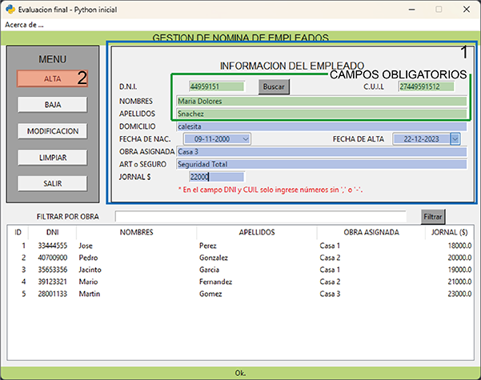
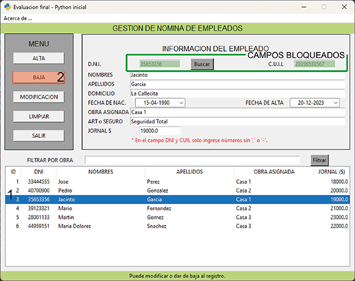
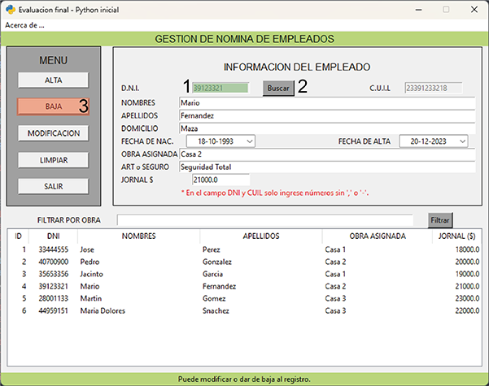
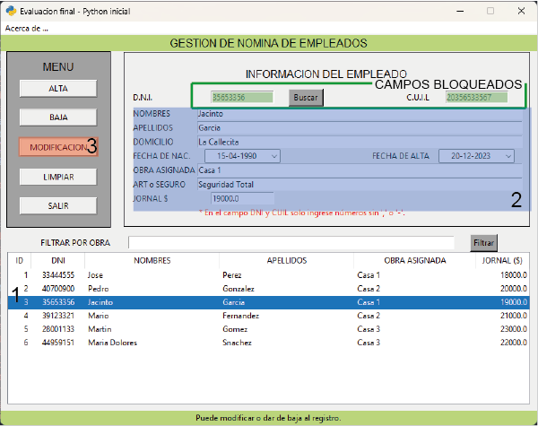
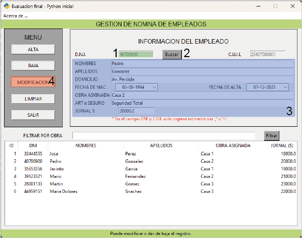
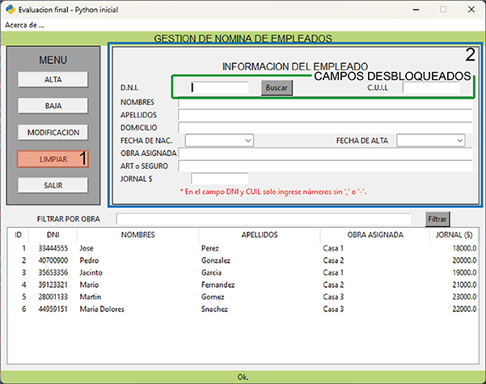
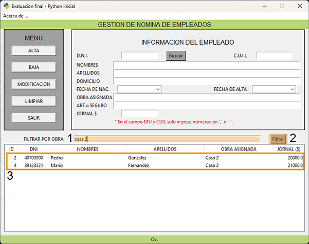
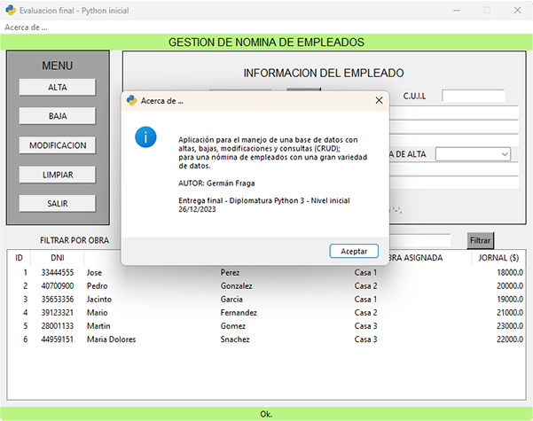

.. Manual de uso de la aplicación
.. ==============================

1. Descripcion general
----------------------
Se trata de una aplicación para el manejo de una nómina de empleados.
La visualización de la misma será con TKinter, que por medio de sus widgets podremos hacer las altas, bajas, modificaciones y consultas (CRUD). La información a manipular será guardada en una base de datos a través de SQLite3.

2. Pantalla principal - Sus componentes
---------------------------------------

.. figure::  images/inicial.png
   :align:   center

A. Área de menú de comandos.
++++++++++++++++++++++++++++
   A.1 Botón para dar de alta al registro.

   A.2 Botón para la baja del registro previamente seleccionado.

   A.3 Botón para la modificación del registro previamente seleccionado.

   A.4 Botón para limpiar los campos de ingreso de datos.

   A.5 Botón para salir de la aplicación.

B. Área para manejo de datos.
+++++++++++++++++++++++++++++
   B.1 DNI (será controlado el tipo y longitud de dato) dato obligatorio.

   B.2 CUIL (será controlado el tipo y longitud de dato) dato obligatorio.

   B.3 Nombres de la persona, dato obligatorio.

   B.4 Apellidos de la persona, dato obligatorio.

   B.5 Domicilio en el cual reside actualmente.

   B.6 Fecha de nacimiento, se puede ingresar directamente o con un almanaque.

   B.7 Fecha de alta, por defecto aparece la fecha actual, pero se puede modificar con la misma metodología que el punto anterior.
   
   B.8 Obra a la cual fue asignado a trabajar.

   B.9 Seguro de accidentes personales o A.R.T.

   B.10 El jornal que percibe por día de trabajo.

   B.11 Botón de búsqueda.

C. Área Listado.
++++++++++++++++
   C.1 Ingresar nombre de obra por la que se quiere filtrar el listado.

   C.2 Botón para aplicar el filtro.

   C.3 Listado de todas las obras o el contenido filtrado.

D. Área de notificación o status de las actividades.
++++++++++++++++++++++++++++++++++++++++++++++++++++
3. Manual de uso.
-----------------
3.a. Alta de un registro: 
+++++++++++++++++++++++++
Para poder dar de alta a un empleado es necesario completar todos los campos, en especial los obligatorios (DNI (B.1), CUIL (B.2), Nombres (B.3) y Apellidos (B.4)) Para el DNI es necesario que sean solo números y una cantidad mínima de dígitos de 7 y máxima de 8 sin colocar puntos. Para CUIL son 11 dígitos y sin colocar los guiones.

Para las fechas se pueden ingresar directamente o a través de los almanaques que se despliegan.

Una vez completados todos los datos se debe dar al botón de ALTA (A.1) y será agregado al listado de abajo (C.3) y grabado en la base de datos. En caso de errores será alertado con una ventana emergente y en todos los casos se le informará sobre el proceso en el área de notificación.

3.b. Baja de un registro: 
+++++++++++++++++++++++++
Hay dos caminos distintos para dar de baja a algún registro. 

1.	Una manera es seleccionando el mismo desde el listado en la parte inferior y luego se completarán todos los campos (B) con los datos correspondientes a ese registro.
2.	La otra alternativa es ingresar el número de DNI en el campo (B.1) con dicho nombre y presionar el botón de Buscar (B.11). Este traerá a los campos los datos correspondientes de ese registro. En casa que no exista en la base de datos ese número de DNI se dará una advertencia.

En ambos métodos luego se debe presionar el botón de BAJA (A.2) se consultará si está seguro de ejecutar la sentencia y con la afirmación se borrará la información en el listado de abajo y de la base de datos. En caso de errores será alertado con una ventana emergente y en todos los casos se le informará sobre el proceso en el área de notificación.

**OPCION 1**

**OPCION 2**

3.c. Modificación de un registro: 
+++++++++++++++++++++++++++++++++
Los procedimientos para la modificación de algún dato correspondiente a un registro son: 

1.	Una manera es seleccionando el mismo desde el listado en la parte inferior y luego se completarán todos los campos (B) con los datos correspondientes a ese registro. 
2.	La otra alternativa es ingresar el número de DNI en el campo (B.1) con dicho nombre y presionar el botón de Buscar (B.11). Este traerá a los campos los datos correspondientes de ese registro. En casa que no exista en la base de datos ese número de DNI se dará una advertencia.

En ambos métodos se bloquearán los campos de DNI (B.1) y CUIL (B.2), los cuales no podrán ser modificados. Luego se debe presionar el botón de MODIFICAR (A.3) se consultará si está seguro de ejecutar la sentencia y con la afirmación se actualizará la información del listado de abajo y de la base de datos. En caso de errores será alertado con una ventana emergente y en todos los casos se le informará sobre el proceso en el área de notificación.

**OPCION 1**

**OPCION 2**

3.d. Limpieza de las cajas de entrada: 
++++++++++++++++++++++++++++++++++++++
Luego de hacer una consulta de la información de algún registro se puede hacer el borrado de todos los campos (B) presionando en el botón de LIMPIEZA (A.4). Al vaciar los campos se volverán a habilitar las cajas de DNI (B.1) y CUIL (B.2) para poder ingresar datos.

3.e. Filtro por nombre de obra: 
+++++++++++++++++++++++++++++++
En el área del listado se propone la posibilidad de hacer un filtrado del mismo por el nombre de la obra asignada, y de esa manera tener la nómina correspondiente a cada obra.

Se debe completar el campo con el nombre de la obra (C.1) y luego presionar el botón de Filtrar (C.2).

Si se deja vacío el campo de filtrado y se presiona el botón Filtrar se volverá a mostrar todos los registros. En caso de errores será alertado con una ventana emergente y en todos los casos se le informará sobre el proceso en el área de notificación.

3.f. Selección en listado: 
++++++++++++++++++++++++++
Ya sea en el listado (C.3) completo o filtrado, al seleccionar un registro automáticamente se completarán todos los datos disponibles en el área de carga de datos. Para a posteriori poder ejecutar una BAJA o MODIFICACION.

3.g Barra de menú.
++++++++++++++++++
Solo tiene la opción de “Acerca de …” que hace abrir una ventana de información con una pequeña descripción de la aplicación y los datos del autor.

